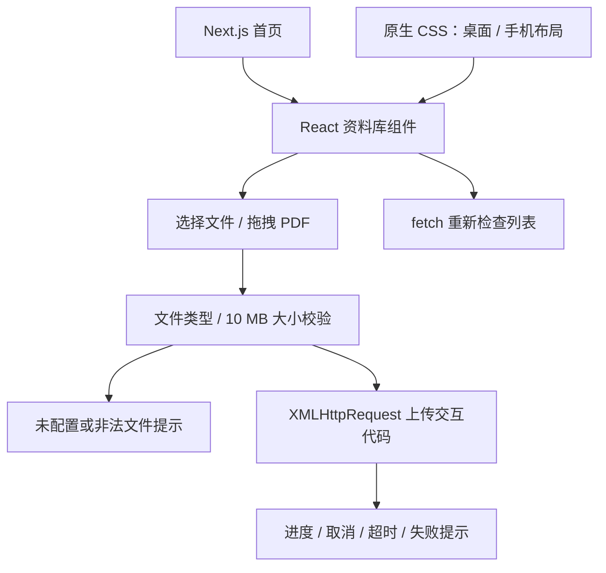

# 企业 Agent 平台 · 页面交互结构

更新日期：2026-11-13。只展示第一步已有实现。

```mermaid
flowchart TD
    Page["Next.js 首页"] --> View["React 资料库组件"]
    CSS["原生 CSS：桌面 / 手机布局"] --> View
    View --> Input["选择文件 / 拖拽 PDF"]
    Input --> Check["文件类型 / 10 MB 大小校验"]
    Check --> Feedback["未配置或非法文件提示"]
    Check --> Upload["XMLHttpRequest 上传交互代码"]
    Upload --> State["进度 / 取消 / 超时 / 失败提示"]
    View --> Refresh["fetch 重新检查列表"]
```

页面和提示已做浏览器检查；真实上传进度与取消尚未实测。第二步数据库设计待执行，不在此提前绘制未落地结构。

具体状态见[两步实施计划](../plans/2026-11-07-v1-engineering-compatibility.md)。
